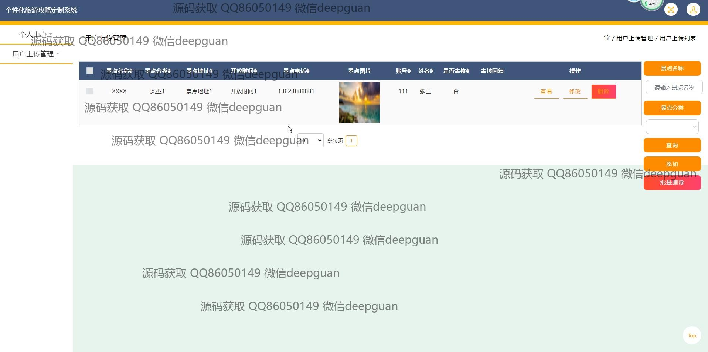

<h1 align="center">个性化旅游攻略定制系统设计与实现+jsp</h1>

## 简介
个性化旅游攻略定制系统：用户分为管理员和游客；功能包括旅游路线管理、景点信息展示与管理、用户信息编辑、评论与收藏功能。    --计算机毕业设计源码；毕设源码；java毕业设计源码

## 联系方式

<h3 align="center">获取完整代码与数据库文件 + 微信：deepguan QQ: 86050149 QQ群: 783742310</h3>

<h3 align="center">可帮忙远程部署 包运行成功！提供远程部署、修改代码、设计文档指导、代码讲解等服务！</h3>

## 功能介绍（完整见运行截图）
管理员： 基本功能包括用户管理、景点管理、旅游路线管理和审核功能。管理员可以查看和修改用户信息以及审核用户上传的景点内容。系统支持景点信息、分类、地址、开放时间、电话和图片的管理，提供高级操作如批量删除、增加和筛选功能。管理员还可以管理旅游路线，调整路线名称、分类、起止点和天数等信息。

用户： 用户具备注册和登录功能，可以通过系统浏览和选择个性化旅游推荐，包括景点信息和旅游路线。用户能够对景点和路线进行收藏、评论和打分，以便个性化定制旅游攻略。个人中心允许用户查看和编辑个人信息，包括账号、密码、姓名、性别、手机、地址和兴趣等，同时用户可以上传头像。用户还可以上传旅行路线和景点图片，通过互动分享体验。

## 运行截图

本代码来源于网络,仅供学习参考使用!

